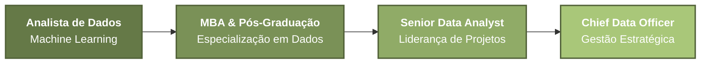

<div align="center">

# Olá, seja bem vinde ao meu perfil!!


</div>

---

## Sobre Mim

Sou **graduando em Engenharia** pela **UNESP Guaratinguetá** com foco em análise de dados e tomada de decisões orientadas por evidências. Minha trajetória acadêmica e projetos pessoais refletem uma paixão por transformar dados brutos em insights acionáveis.

Busco oportunidades como **Analista de Dados**, onde posso aplicar minhas habilidades em **análise exploratória**, **visualização de dados** e **automatização de processos**. Acredito no poder dos dados para impulsionar estratégias inteligentes e gerar valor real para organizações.

## Stack Tecnológica

<div align="center">

### Linguagens & Ferramentas

<table>
<tr>
<td align="center" width="96">

<br><strong>Excel</strong>
</td>
<td align="center" width="96">

<br><strong>Python</strong>
</td>
<td align="center" width="96">

<br><strong>SQL</strong>
</td>
<td align="center" width="96">

<br><strong>Power BI</strong>
</td>
<td align="center" width="96">

<br><strong>JavaScript</strong>
</td>
</tr>
</table>

</div>

---

### Níveis de Proficiência

<div align="center">


</div>

<br>

<p align="center">
  
  
  
</p>

<p align="center">
  
  
  
  <br>
  <sub>
  </sub>
</p>

<p align="center">
  
  
  
</p>

<p align="center">
  
  
  
</p>

<p align="center">
  
  
  
</p>

<p align="center">
  
  
  
</p>

<p align="center">
  
  
  
</p>

---
### Outras Ferramentas & Metodologias

<div align="center">


**Engenharia de Dados**: ETL/ELT • Data Wrangling • Data Pipelines

**Metodologias**: Lean Six Sigma • DMAIC • Testes A/B • Análise de Coorte • ROI/LTV • PDCA

</div>

---

## Projetos em Destaque

<div align="center">

<table>
<tr>
<td width="50%" valign="top">

### Análise de Dengue no Brasil - 2025

[](https://github.com/Igor-TCA/ANALISE_DENGUE)

**Análise Epidemiológica de Big Data em Saúde Pública**

---

#### Stack Tecnológica


#### Resultados & Impacto

```
-> Volume de Dados
   └─ 1.5M+ registros processados

-> Cobertura Geográfica
   └─ 27 estados | 5.571 municípios

-> Insights Estratégicos
   ├─ Taxa de óbito 24x maior em idosos
   ├─ Hotspots identificados por região
   └─ Padrões de incidência mapeados

-> Técnicas Aplicadas
   ├─ Data Cleaning & Wrangling
   ├─ Mapas Coropléticos
   ├─ Heatmaps de Correlação
   └─ Queries SQL Otimizadas
```

#### O que destaca este projeto

✅ Manipulação de **Big Data** (1.5M+ registros)  
✅ Visualização **Geoespacial** avançada  
✅ Padrões oficiais SINAN aplicados  
✅ Integração **Python + SQL**  
✅ Dashboard multi-painel completo  

</td>
<td width="50%" valign="top">

### Agente Inteligente iFood GenAI

[](https://github.com/Igor-TCA/IFOOD_GENAI)

**Sistema RAG para Decisões Automatizadas com IA**

---

#### Stack Tecnológica


#### Arquitetura & Performance

```
-> Componentes do Sistema
   ├─ Motor de Políticas (16 regras)
   ├─ Busca Semântica (TF-IDF)
   ├─ Integração LLM (GPT + Gemini)
   └─ Fallback Local (robustez)

-> Sistema de Decisão
   ├─ Automático: Score ≥ 0.8
   ├─ Revisão: 0.4 < Score < 0.8
   └─ Escalamento: Score < 0.4

-> Auditoria & Qualidade
   ├─ Logging estruturado (JSONL)
   ├─ Testes unitários (pytest)
   └─ Rastreamento completo

-> Técnicas Avançadas
   ├─ RAG (Retrieval-Augmented Generation)
   ├─ Expansão de sinônimos
   └─ Scoring transparente multi-fator
```

#### O que destaca este projeto

✅ Arquitetura **RAG** empresarial  
✅ Integração com **múltiplos LLMs**  
✅ Sistema **híbrido** (IA + Regras)  
✅ **Auditoria** financeira completa  
✅ Design **escalável** e modular  

</td>
</tr>
</table>

</div>

---

##  Outros Projetos

<details>
<summary><b> Análise de E-Commerce Brasileiro</b> - Inteligência de Mercado & Logística</summary>
<br>

- Análise de ~100k transações de e-commerce
- Identificação de sazonalidade e categorias rentáveis
- Avaliação de tempos de entrega e performance regional
- Validação de hipóteses de negócio com dados reais

**Stack**: Python • Pandas • Matplotlib • Seaborn

</details>

<details>
<summary><b> Kanban App</b> - Aplicação de Gerenciamento de Tarefas</summary>
<br>

- Quadro Kanban com agenda semanal
- Interface web moderna (HTML/CSS/JS)
- Backend Python com PyQt6
- Versão desktop com Electron

**Stack**: JavaScript • Python • PyQt6 • Electron

</details>


</details>

<details>
<summary><b>Experimento A/B/C Méliuz</b> - Estratégia de Cashback</summary>
<br>

- Análise de experimento A/B/C com 2.327 transações de 300 usuários
- Avaliação de 3 percentuais de cashback (1.5%, 2.0%, 2.5%)
- Cálculo de métricas: GMV, Ticket Médio, ROI, Crescimento e Retenção
- Recomendação baseada em dados: cashback de 2.0% como ponto ótimo
- Validação de crescimento sustentável (+52.6%) e retenção positiva (+20.8%)

**Stack**: Python • Pandas • Matplotlib • Análise Estatística

</details>

---

## Certificações

<div align="center">

| Certificação | Instituição | Ano | Competências Desenvolvidas |
|--------------|-------------|-----|---------------------------|
| **Green Belt Lean Six Sigma** | - | 2023 | Metodologia DMAIC • Inferência Estatística & Testes de Hipótese • Análise de Regressão e Correlação |
| **Fundamentos para Análise de Dados** | - | 2024 | Data Cleaning & Wrangling • Consultas SQL • Análise Exploratória • Data Storytelling • LGPD/GDPR |
| **Torne-se um Cientista de Dados** | - | 2025 | Pré-processamento de Dados • NumPy • Pandas • Matplotlib • Seaborn • Scikit-Learn |
| **Análise de Dados com SQL Server** | - | 2025 | Manipulação de Dados • Tratamento de Dados • Agregações • Ranking |

</div>

---

##  Objetivos Futuros

<div align="center">



</div>

###  Trajetória Planejada

 **Curto Prazo** (2026-2027)
- Atuar como **Analista de Dados**, aplicando técnicas de **Machine Learning** para otimização de buscas e relatórios
- Aprofundar conhecimentos em **Python** para análise preditiva e automação
- Desenvolver expertise em **dashboards interativos** e storytelling com dados

 **Médio Prazo** (2028-2030)
- Buscar **MBA** e **pós-graduação** na área de Ciência de Dados e Analytics
- Desenvolver habilidades em **MLOps** e **engenharia de dados**
- Contribuir com projetos open source e compartilhar conhecimento na comunidade

 **Longo Prazo** (2030+)
- Alcançar o posto de **Chief Data Officer (CDO)**
- Liderar times de dados, estruturando estratégias data-driven para organizações
- **Treinar e capacitar equipes**, compartilhando experiência e fomentando cultura de dados
- Implementar **governança de dados** e políticas de privacidade em escala empresarial

---

## Idiomas

<div align="center">

| Idioma | Nível |
|--------|-------|
| **Português** | Nativo |
| **Inglês** | Avançado |
| **Espanhol** | Iniciante |

</div>

---

##  GitHub Stats

<div align="center">


</div>

---

## Contato

<div align="center">

[](https://www.linkedin.com/in/igor-tca/)
[](mailto:igor_act@hotmail.com)
[](https://github.com/Igor-TCA)

</div>

---

<div align="center">


</div>
